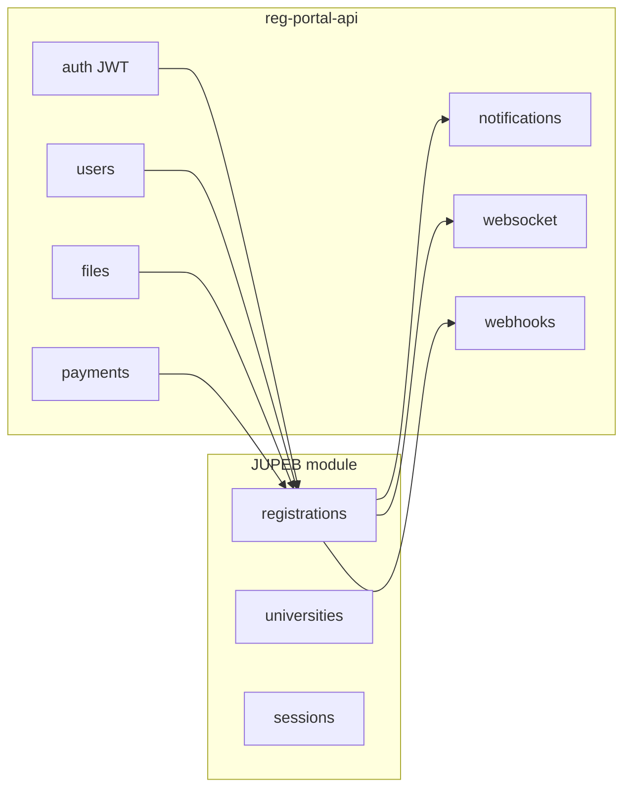

# JUPEB registration API design

This document specifies the **JUPEB registration API** (this app’s core domain): institution onboarding, NIN verification, candidate codes, student app completion, approval-gated dashboard, registrar sessions, payments, and optional grading rules. It extends **[`reg-portal-api`](../README.md)** without replacing its generic building blocks. **HTTP paths have no `/jupeb` prefix** (e.g. `/catalog`, `/registration`); the JUPEB router is mounted at the API root in `src/routes/index.js`.

**OpenAPI:** Per-design Swagger specs live in **`docs/jupeb-001-catalog-swagger.yaml`** through **`docs/jupeb-009-institution-scope-swagger.yaml`**, registered in `src/routes/index.js` as `/docs/jupeb-001-catalog` … `/docs/jupeb-009-institution-scope` (in addition to `jupeb-008-overview`). This `.md` file carries narrative, state machine, and integration notes; the YAML files document HTTP paths and auth.

---

## 1. Source overview (business flow)

1. **Institution:** Program director collects details, selects subject combination, verifies identity via **NIN**, then generates a **university-specific candidate code**.
2. **Candidate numbers:** Provisional code uses **university prefix** (e.g. University of Ibadan `001`) plus **serial**. After the registration **session closes**, the **registrar** assigns the final JUPEB candidate number: **`[YY][University Prefix][Serial]`** (example for 2027: `270010001`).
3. **Student app:** Student enters the institution code; app loads **NIN-derived** profile data; student **confirms** subject combination (or returns to institution for corrections); then **documents** and **biometrics** (fingerprint, facial capture).
4. **Dashboard:** Locked until the **institution approves** registration; then full portal access.
5. **Admin:** Registrar manages **universities**, **registration sessions** (open/close, timelines). **Financials** via in-app payments (e.g. Paystack, Flutterwave); finance staff track and confirm fees after successful payment.
6. **Grading (optional phase):** Passing grades **A–E** each contribute **+1** to an overall score; **F** does not.

---

## 2. Mapping to existing `reg-portal-api` features

| Need | Existing module / path |
|------|-------------------------|
| Authentication | `auth` — JWT access + refresh |
| Institution vs student vs finance roles | **RBAC** — extend `src/db/seeds/002_seed_rbac.sql` |
| Profile, addresses | `users` |
| Identity / document uploads | `POST /users/me/kyc`, **`files`** |
| Fee collection | **`/payments`** — Paystack, Flutterwave, webhooks, bank transfer |
| User-facing events | **`notifications`**, optional **`websocket`** |
| User HTTP callbacks | **`webhooks`** — `WebhookService.fire(userId, event, payload)` |
| Global kill-switches / flags | **`/admin/settings`** (optional; prefer domain tables below) |
| Audit | **`/admin/audit`**, error/slow request logging |

**New domain** (dedicated `jupeb` module): universities, sessions, registrations, provisional/final candidate numbers, institution-issued codes, NIN verification adapter, subject combinations, document requirements, biometric metadata, approval workflow, payment linkage to a registration.

---

## 3. Base path and versioning

- **Mount:** JUPEB routes are mounted at **`/`** in `src/routes/index.js` (before `/admin` so `PATCH /admin/users/.../jupeb-university` is handled). Paths are rooted at feature segments: `/catalog`, `/sessions`, `/registration`, etc.
- **Versioning:** Use `/v1/...` at the reverse proxy *or* keep unversioned paths under the API’s global v1; pick one convention and document it in OpenAPI `servers` / `info`.

---

## 4. Component-to-module grouping (11 components)

The 11 components should live under one top-level `jupeb` module, but be split into focused internal sub-modules for maintainability.

**Definition of registration in this document:**  
`registration` means the **JUPEB enrollment record for a candidate in a specific session and university**.  
It is not the same thing as generic user profile/biodata, and it is also not a full KYC module. It references verified identity signals (for example NIN result) and captures JUPEB-specific workflow state.

| Internal module | Included components | Notes |
|-----------------|---------------------|-------|
| `catalog` | 1) Universities, 2) Subject Combinations | Master data used by institution and registrar workflows |
| `sessions` | 3) Registration Sessions | Session lifecycle, timelines, open/close controls |
| `identity` | 6) NIN Verification Adapter, 8) Biometrics | Identity proofing boundary only (verification + biometric capture metadata) |
| `registration` | 4) Registrations, 5) Approval + Dashboard Lock/Unlock, 10) Student Numbering/Finalization | JUPEB candidate workflow/state machine, institution approval, and final candidate numbering after session close |
| `submission` | 7) Documents | Student evidence/document collection and requirement tracking |
| `finance` | 9) Payment Linkage/Reconciliation | Bridges `jupeb` registrations with existing `/payments` module |
| `academic` *(optional phase 2)* | 11) Grading/Scoring | Grade ingestion and score calculation rules |

### Suggested folder shape

```text
src/modules/
  routes.js
  controllers/
    catalog.controller.js
    session.controller.js
    registration.controller.js
    identity.controller.js
    submission.controller.js
    finance.controller.js
    academic.controller.js          # phase 2 (courses + results + scores)
  services/
    catalog.service.js
    session.service.js
    registration.service.js
    registration-state.service.js
    approval.service.js
    candidate-numbering.service.js
    nin-adapter.service.js
    biometric.service.js
    document-submission.service.js
    finance-reconciliation.service.js
    academic-scoring.service.js     # optional phase 2
  models/
    university.model.js
    registration-session.model.js
    subject-combination.model.js
    registration.model.js
    registration-document.model.js
    biometric-capture.model.js
    registration-payment.model.js
    registration-result.model.js    # optional phase 2
  middleware/
    institution-scope.middleware.js
```

This grouping keeps responsibilities clear while still exposing a unified external API at `/...`.

---

## 5. RBAC: roles and permissions

### Roles (add to seeds; names illustrative)

| Role | Purpose |
|------|---------|
| `student` | Completes registration after claiming institution code |
| `program_director` | Institution: NIN verify, create/update provisional registration, subject combination |
| `institution_admin` | Optional umbrella per university |
| `registrar` | Universities, sessions, close session, **finalize** JUPEB numbers |
| `financial_admin` | View/confirm fee state tied to registrations |

Keep existing `admin` / `super_admin` for full override.

### Permissions (examples)

- `jupeb.universities.manage`
- `jupeb.sessions.manage`
- `jupeb.registrations.institution` (create, list, approve, reject scoped by university)
- `jupeb.registrations.registrar` (sessions, finalize numbers)
- `jupeb.finance.view`

**Institution scoping:** Institution users must be bound to a **`university_id`** (profile column or join table). Middleware rejects cross-university access.

---

## 6. Core data model (conceptual)

| Entity | Key fields / notes |
|--------|---------------------|
| `universities` | `id`, `name`, `jupeb_prefix` (e.g. `001`), `active`, metadata |
| `registration_sessions` | `academic_year`, `opens_at`, `closes_at`, `status` (`draft` \| `open` \| `closed`), `final_numbers_generated_at` |
| `subject_combinations` | Catalog; may be per-university or global with overrides |
| `registrations` | `session_id`, `university_id`, NIN (**hash** at rest; display last 4 only), `user_id` (nullable until student claims), `subject_combination_id`, `institution_issued_code` (opaque), provisional serial, `jupeb_candidate_number` (nullable until finalized), `status`, `dashboard_unlocked_at`, audit timestamps |
| `registration_documents` | `registration_id`, `requirement_key`, `file_id` → `files` |
| `biometric_captures` | `registration_id`, `type` (`face` \| `fingerprint`), `file_id` or external vault reference, metadata (device, quality) — comply with local privacy law |
| `payments` link | Add nullable **`registration_id`** FK to `registrations`, *or* reuse opaque `campaign_id` on `payments` as `registration.id` until schema migration |

---

## 7. Registration status state machine

Enforce transitions in the service layer (dedicated endpoints; avoid arbitrary `PATCH` on `status`).

| Status | Meaning |
|--------|---------|
| `provisional` | Institution verified NIN and created record |
| `code_issued` | Institution code generated; not yet claimed in app |
| `claimed` | Student submitted valid code; `user_id` bound |
| `pending_student_confirm` | Profile shown; awaiting student confirmation of subjects |
| `pending_documents` | Subjects confirmed; documents/biometrics incomplete |
| `pending_institution_review` | Student submitted; **dashboard locked** |
| `approved` | Institution/registrar approved; **dashboard unlocked** |
| `rejected` | With stored reason |
| `withdrawn` | Student or admin |

---

## 8. HTTP API (by actor)

**Implemented enrollment base path:** `/registration` (e.g. `POST /registration/institution/registrations`, student `POST /registration/me/claim-code`, `GET /registration/sessions/:sessionId/numbering-preview`). Session lifecycle and `POST /sessions/:id/finalize-candidate-numbers` remain under `/sessions`.

**Implemented finance base path:** `/finance` (student `POST /finance/me/checkout`, `GET /finance/me/payments`; finance roles: `GET /finance/payments`, `GET /finance/registrations/:id/payment-summary`, `POST .../reconcile`, `GET /finance/reports/session/:sessionId`). `payments.registration_id` links rows to `jupeb_registrations`.

**Implemented academic base path (phase 2):** `/academic` — public `GET /courses` (active catalog); registrar/admin course create; result entry and score read per `docs/007-jupeb-academic-technical-design.md`.

### 8.1 Registrar / system admin

| Method | Path | Description |
|--------|------|-------------|
| `GET`, `POST`, `PATCH` | `/universities` | List/create/update universities; enable/disable |
| `GET`, `POST`, `PATCH` | `/sessions` | Manage registration sessions and timelines |
| `POST` | `/sessions/:id/close` | Idempotent close |
| `POST` | `/sessions/:id/finalize-candidate-numbers` | Batch-assign `jupeb_candidate_number` (`[YY][prefix][serial]`) for eligible rows; set `final_numbers_generated_at` |
| `GET` | `/sessions/:id/stats` | Counts by status, payment summaries |

### 8.2 Institution (`program_director`, `institution_admin`, scoped by university)

| Method | Path | Description |
|--------|------|-------------|
| `POST` | `/institution/nin/verify` | Body: `nin`, optional `session_id`. Returns verification result / masked profile via **NIN provider adapter** (implement mock for dev) |
| `POST` | `/institution/registrations` | Create provisional registration; return `institution_issued_code` |
| `PATCH` | `/institution/registrations/:id` | Correct subject combination before student confirms |
| `GET` | `/institution/registrations` | Query filters: `status`, `session_id`, pagination |
| `POST` | `/institution/registrations/:id/approve` | Approve → unlock dashboard; emit notification + webhook + optional WebSocket |
| `POST` | `/institution/registrations/:id/reject` | Body: `reason` |

**Alternative auth for institution systems:** service **`api-keys`** mapped to `university_id` + custom middleware.

### 8.3 Student (JWT; registration bound after claim)

| Method | Path | Description |
|--------|------|-------------|
| `POST` | `/me/claim-code` | Body: `institution_issued_code`. Bind `user_id`; advance status |
| `GET` | `/me/registration` | Current registration, lock state, next steps |
| `POST` | `/me/confirm-subjects` | Confirm subject combination; **409** if student disputes (must return to institution per policy) |
| `POST` | `/me/documents` | Body: `requirement_key`, `file_id` (file created via existing **`/files`** upload) |
| `POST` | `/me/biometrics` | `type` + file reference per policy |
| `POST` | `/me/submit` | Move to `pending_institution_review`; dashboard stays locked until approve |
| `GET` | `/me/dashboard` | **403** or `{ locked: true }` until approved — or derive solely from `GET .../registration` |

**Fees:** Initiate checkout with existing **`POST /payments/...`**; pass **`registration_id`** (after migration) or **`campaign_id`** = registration UUID so Paystack/Flutterwave **webhooks** can update registration payment state.

| Method | Path | Description |
|--------|------|-------------|
| `GET` | `/me/payments` | Optional thin wrapper: payments for current registration |

### 8.4 Financial admin

| Method | Path | Description |
|--------|------|-------------|
| `GET` | `/finance/payments` | List payments joined to registrations (filters: session, status, gateway ref) |
| `GET` | `/finance/registrations/:id/payment-summary` | Single registration fee reconciliation view |

### 8.5 Academic / grading (phase 2)

| Method | Path | Description |
|--------|------|-------------|
| `POST` | `/academic/courses/:id/results` | Record grades per student (`A`–`F`) |
| `GET` | `/academic/registrations/:id/score` | Apply rule: **A–E → +1 each**; **F → 0**; return breakdown |

Persist raw rows in e.g. `registration_course_results`; keep scoring in a pure function/service for tests.

---

## 9. Events and real-time

- **Notifications:** e.g. `registration.approved`, `registration.rejected`, `payment.confirmed` — use existing `notifications` table.
- **User webhooks:** `WebhookService.fire(userId, 'jupeb.registration.approved', payload)` (and similar events).
- **WebSocket:** push `jupeb:registration_updated` (or equivalent) to the user’s room after approval.

---

## 10. Implementation checklist (this repository)

1. Add **`src/modules/`** — `routes.js`, controllers, services, models (mirror `payments` or `posts` layout).
2. Add SQL migration(s): **`002_jupeb_catalog.sql`**, **`003_jupeb_sessions.sql`**, **`004_jupeb_identity.sql`**, **`005_jupeb_submission.sql`**, then later tables from section 6; optional **`registration_id`** on `payments`. Run **`npm run migrate`** after pulling.
3. Extend **`002_seed_rbac.sql`** with roles and permissions from section 4.
4. OpenAPI: **`docs/jupeb-00N-*-swagger.yaml`** (001–009) registered in `swaggerDocs` and root `documentation` in `src/routes/index.js`.
5. **NIN provider:** interface + dev mock + production implementation; never log raw NIN in application logs.

---

## 11. Architecture sketch



---

## Document history

| Date | Change |
|------|--------|
| 2026-04-27 | Initial design from JUPEB overview + `reg-portal-api` feature map |
